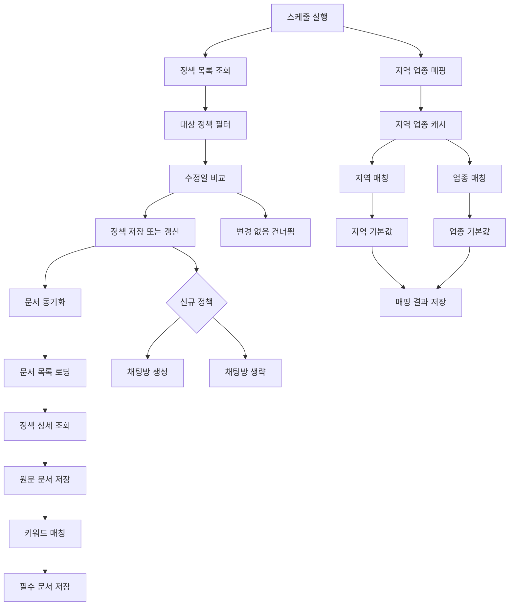

# Policy Sync Flow Diagram



Notes:
- Scheduled task runs daily at 03:00.
- Only changed/new policies are persisted.
- Document mapping uses keyword-based matching with de-duplication.
- Category matching caches region/industry lists to reduce DB load.
```
